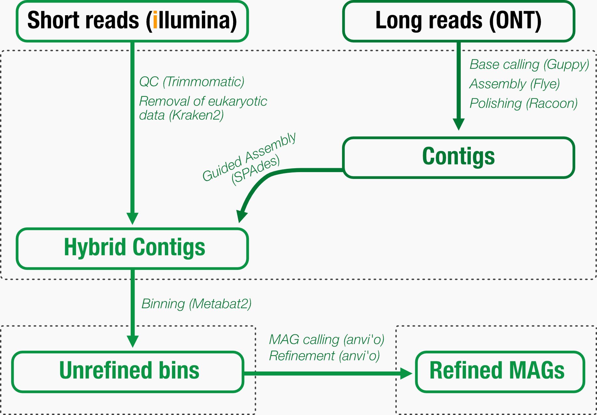

# Engineering gut microbiome of Musca domestica for an increased food production

*This Github repository hold all information to reproduce the work of Asmus et al. (in prep)*

The housefly (Musca domestica) is a fly of the suborder Cyclorrhapha. It possibly originated in the Middle East, and spread around the world as a commensal of humans. It is the most common fly species found in houses. Here we investigate the gut microbiome of the house fly and how it helps for niche adaptation and food utilisation. 

## Bioinformatic processing

For extended information of the bioinformatic processing, please find scripts and information in repository named **Bioinformatics**.

The pipeline is illustrated below. In short, we generated both long (ONT) and short (Illumina) read data to increase completion of metagenomic-assembled genomes (MAGs), by hybrid assembly with *Flye* and *SPAdes*. Subsequently, contigs were automatically binned by *Metabat2* and manually refined using *anvi'o*.

## Analysis

For extended information of the analytical process, please find scripts and information in repository named **Analysis**.

